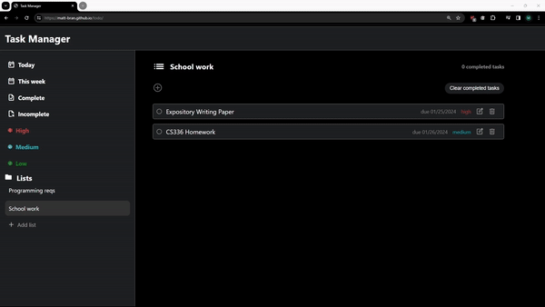

# Task Manager
## [Demo](https://matt-bran.github.io/todo/)

A lightweight web application which produces intuitive task management that allows users to streamline daily work flow.

## Technologies Used
- Javascript
- HTML
- CSS
- Webpack

## Features 
- Task Creation: Easily create new tasks with detailed information.
- Task Editing: Seamlessly edit task details and update progress.
- Task Deletion: Effortlessly remove completed or unnecessary tasks.
- Intuitive User Interface: Enjoy a user-friendly interface for a smooth task management experience.
